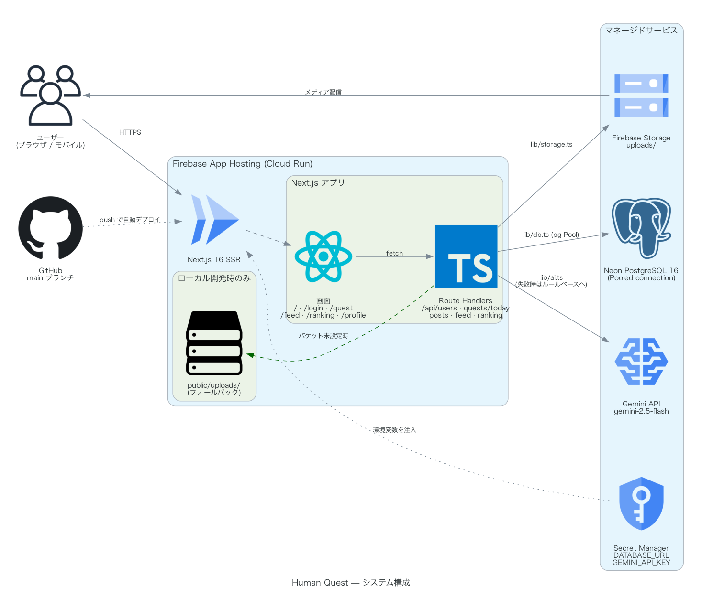
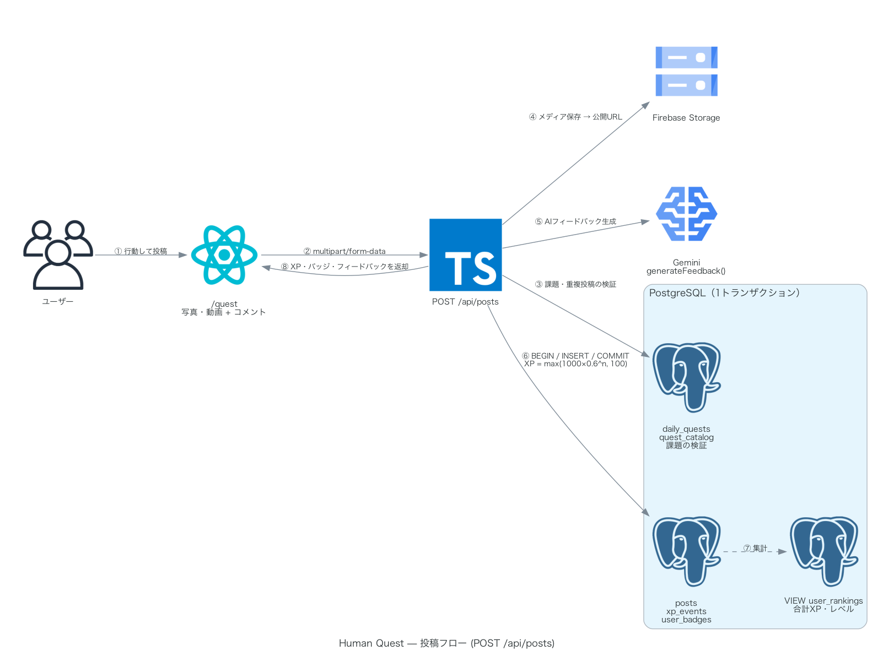

# 開発ガイド（CONTRIBUTING）

Human Quest のローカル開発環境のセットアップと開発ルールをまとめる。
本番リリース手順は [DEPLOY.md](DEPLOY.md) を参照。

## 技術スタック

| 分類 | 技術 |
| --- | --- |
| フレームワーク | Next.js 16（App Router）+ React 19 + TypeScript |
| スタイル | Tailwind CSS 4（暖色系のペーパートーン＋グロース/エンバーのアクセント、「クエストチケット」モチーフ） |
| DB | PostgreSQL 16（`pg` ドライバ直叩き、ORMなし） |
| AI | Gemini API（`@google/genai`）。APIキー未設定時はルールベースにフォールバック |
| アイコン | lucide-react |

## アーキテクチャ

本番構成（Firebase App Hosting + Neon + Firebase Storage + Gemini）は以下のとおり。



投稿1件（`POST /api/posts`）が処理される流れ：



図は [`docs/architecture.py`](docs/architecture.py)（Python の [diagrams](https://diagrams.mingrammer.com/)）から生成している。構成を変えたときはスクリプトを更新してPNGを再生成する。

```bash
brew install graphviz        # 既に入っていれば不要
pip install diagrams
python docs/architecture.py  # docs/*.png を上書き
```

## セットアップ

前提：Node.js 20+、Docker

```bash
cd human_quest

# 1. 依存関係のインストール
npm install

# 2. 環境変数の設定
cp .env.example .env.local
# GEMINI_API_KEY は任意。未設定でも動く

# 3. DBの起動（初回起動時に db/init/*.sql が自動実行される）
docker compose up -d

# 4. 開発サーバーの起動
npm run dev
```

http://localhost:3000 で起動する。

### DBをリセットしたいとき

```bash
docker compose down -v   # ボリュームごと削除
docker compose up -d     # 再起動時にスキーマ・シードが再適用される
```

## ディレクトリ構成

```
human_quest/
├── app/
│   ├── api/            # Route Handlers（REST API）
│   │   ├── users/                          # POST: ニックネームでログイン（作成 or 取得）
│   │   ├── quests/today/                   # GET: 当日の課題一覧の割当・取得（最大 TARGET_DAILY_QUESTS 件）
│   │   ├── quests/[dailyQuestId]/reroll/   # POST: 課題のリロール（未投稿の課題を入れ替え）
│   │   ├── posts/                          # POST: 投稿（multipart、XP・バッジ付与）
│   │   ├── posts/[id]/                     # reactions / comments
│   │   ├── feed/                           # GET: タイムライン
│   │   └── ranking/                        # GET: ランキング
│   ├── page.tsx         # ランディングページ（未ログイン向け。ログイン済みは/questへ自動遷移）
│   ├── login/ quest/ feed/ ranking/ profile/[userId]/   # 各画面
│   └── layout.tsx       # AppShell（Sidebar/MobileTabBar。LPではシェル非表示）
├── components/          # Avatar, AppShell, Sidebar, MobileTabBar, nav.ts
├── lib/
│   ├── db.ts           # pg Pool（シングルトン）
│   ├── ai.ts           # AIフィードバック・課題選定（フォールバック内蔵、除外リスト対応）
│   ├── xp.ts           # XP計算・レベル計算
│   ├── quests.ts       # TARGET_DAILY_QUESTS（1日の課題件数）
│   └── client/user.ts  # localStorage による擬似認証
├── db/init/            # 01_schema.sql（スキーマ）/ 02_seed.sql（シード）
├── docs/               # architecture.py（構成図の生成スクリプト）と出力PNG
└── public/uploads/     # 投稿メディアの保存先（git管理外）
```

## 設計上のポイント

- **認証は擬似ログイン**：ニックネームのみで、`localStorage`（キー `human-quest-user`）に保存。パスワードなし。デモ用の割り切り。
- **XPは逓減方式**：同じ課題の繰り返しは価値が下がる。`lib/xp.ts` の
  `points = max(round(1000 × 0.6^過去挑戦回数), 100)`。
- **投稿処理はトランザクション**：`app/api/posts/route.ts` で投稿保存・XP付与・バッジ判定を BEGIN/COMMIT で一括処理。
- **ランキングはVIEW**：`user_rankings`（`01_schema.sql` 内）が合計XP・レベル・投稿数・活動日数を集計。
- **AIフォールバック**：`lib/ai.ts` は Gemini API 呼び出しを try/catch で包み、キー未設定・API障害時はルールベースの文言を返す。開発時にAPIキーは不要。
- **複数課題とリロール**：1日あたり `lib/quests.ts` の `TARGET_DAILY_QUESTS` 件を割り当てる。`daily_quests.status`（`active`/`rerolled`）で状態管理し、リロールは行を削除せず `rerolled` にした上で新しい課題を追加する。`quest_catalog.required_media`（`any`/`photo`）が `photo` の課題は動画投稿不可（`app/api/posts/route.ts` でサーバー側にも検証あり）。

## 開発ルール

### コミット前チェック

```bash
npx tsc --noEmit   # 型エラーがないこと
npm run lint       # Lintが通ること
```

### コーディング規約

- スタイルは Tailwind ユーティリティクラスのみ（CSSファイルの追加はしない）
- 配色：`app/globals.css` の `@theme` トークンを使用（背景 `--color-paper`/`--color-paper-warm`、文字 `--color-ink`、副文字 `--color-muted`、罫線 `--color-line`、主アクセント `--color-growth`、クエスト/報酬系アクセント `--color-ember`）。直書きのカラーコードは使わず、新しい色が必要な場合も `globals.css` にトークンとして追加する。
- DBアクセスはAPIルート・サーバーコンポーネント内でのみ行い、`lib/db.ts` の `db` を使う
- SQLは必ずプレースホルダ（`$1, $2...`）を使う
- スキーマ変更時は `db/init/01_schema.sql` を必ず更新する

### 動作確認の目安

ログイン → 今日の課題 → 投稿 → フィード（応援・コメント）→ ランキング → プロフィール
の一連の流れが通ること。モバイル幅（375px）で下部タブバーが表示されることも確認する。

ファイルアップロードをAPIレベルで確認する場合：

```bash
curl -X POST http://localhost:3000/api/posts \
  -F "userId=1" -F "dailyQuestId=1" \
  -F "comment=テスト" -F "media=@test.png"
```
