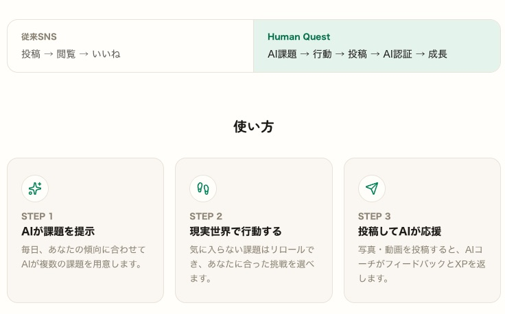
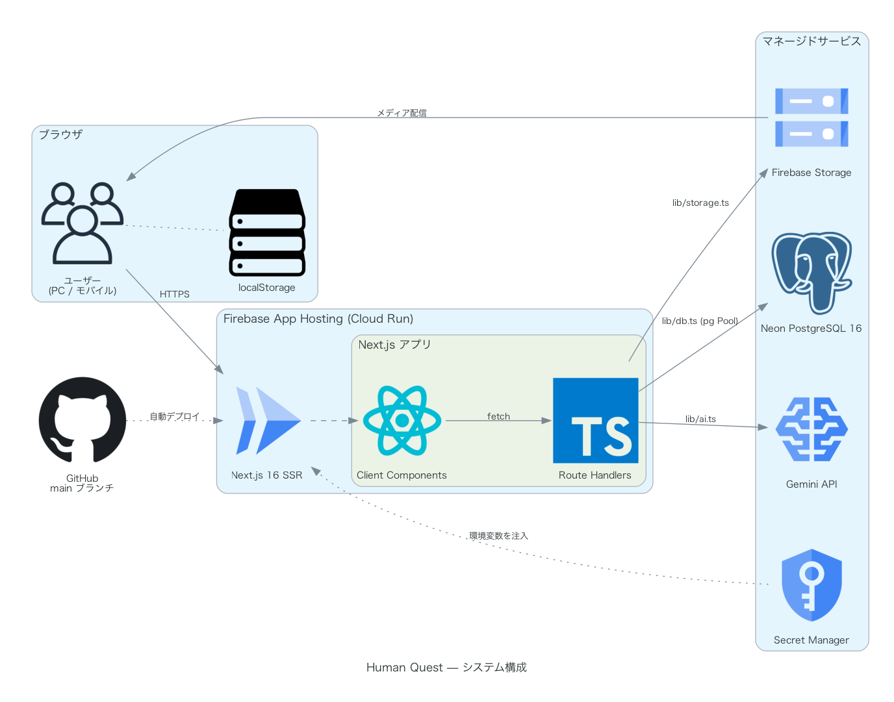
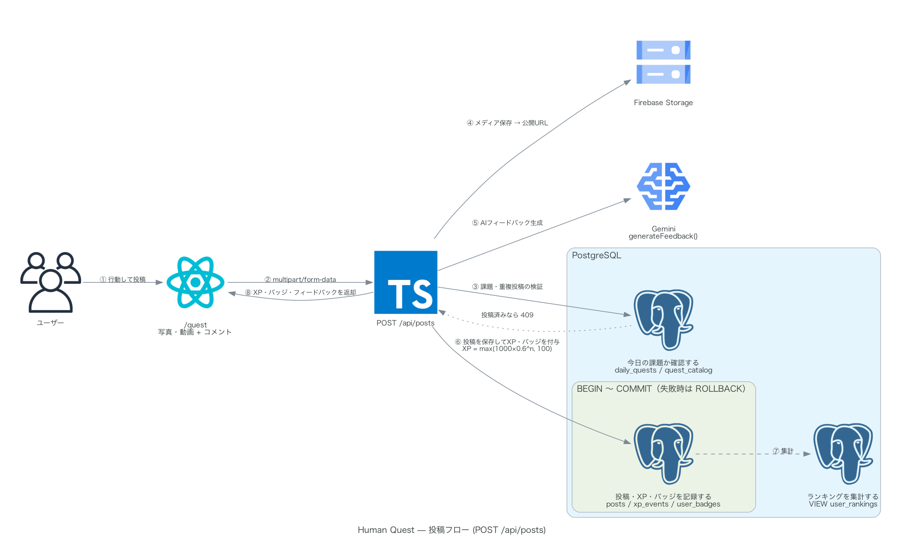
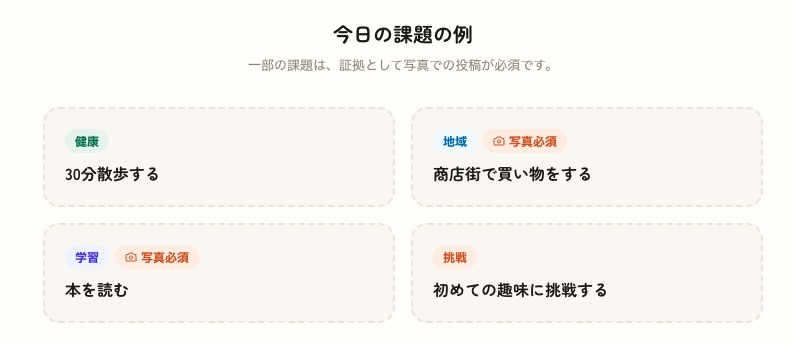

# Human Quest

### AI時代の「人間力」を育てる行動SNS

**デモ**: https://human-quest--human-quest-14a3f.asia-southeast1.hosted.app/

---

## 概要

AI時代において、人間に求められる価値は「知っていること」ではなく、「どう行動するか」に移る。

AIが毎日テーマや課題を提示し、ユーザーが現実世界で行動し、その証拠を写真・動画・位置情報などで投稿するSNSである。

投稿は評価、経験値、バッジ、キャッシュバックなどを通して、人間的な成長を促進する。

---

## システム構成

| レイヤ | 採用技術 |
| --- | --- |
| フロントエンド | Next.js 16 (App Router) / React 19 / Tailwind CSS 4 |
| バックエンド | Next.js |
| データベース | Neon PostgreSQL 16 |
| メディア保存 | Firebase Storage |
| AI | Gemini API |
| ホスティング | Firebase App Hosting |
| 認証 | ニックネームのみの疑似ログイン |

### 投稿フロー（POST /api/posts）

---

## 課題例

---

## AIの役割

AIは以下を担当する。

- 毎日の課題生成
- 難易度調整
- 投稿内容の判定
- 成長分析
- 次のチャレンジ提案

AIは「答え」を教える存在ではなく、「人間を成長させるコーチ」として機能する。

### AIによるパーソナライズ

AIが以下を分析し、最適な課題を毎日提示する。

- 得意分野
- 苦手分野
- 最近不足している経験

例：「最近地域交流が少ないため、今日は近所のお店で買い物してみましょう。」

---

## 成長設計

同じ行動は価値が下がる。
「慣れたこと」より「新しい挑戦」が評価される。

| 挑戦回数 | 獲得ポイント |
| --- | --- |
| 初参加 | 1000pt |
| 2回目 | 600pt |
| 10回目 | 100pt |

---

## SNS機能

- コメント
- 応援
- 共感
- 仲間募集
- グループチャレンジ
- 地域ランキング

評価対象は「映え」ではなく「挑戦」「継続」「社会貢献」である。

---

## 報酬

> **現在の実装状況**：本ドキュメントは企画全体のビジョンを示すものです。現バージョン（MVP）で実装済みなのは「デジタル」報酬（経験値・レベル・バッジ）のみで、「リアル」報酬（キャッシュバック・クーポン・地域ポイント）およびスポンサー連携は今後の展開として計画中・未実装です。

---

## 不正対策

| リスク | 対策 |
| --- | --- |
| AI生成画像 | リアルタイム撮影、複数フレーム解析、AI画像検知 |
| 他人画像 | 類似画像検索、重複検知 |
| 昔の写真 | GPS、撮影時刻、ライブ撮影 |
| Bot | レート制限、行動分析、デバイス認証 |
| 捨て垢 | 本人確認（eKYC）、SMS認証、身分証確認 |
| 組織的不正（マッチポンプ、相互いいね集団、組織投稿など） | AI異常検知、信頼スコア、ランダム監査、通報システム |

---

## 将来展望

自治体・企業・学校・大学・NPOなどと連携し、「人間力を育てる社会インフラ」として発展させる。

---

## キャッチコピー

- AIが成長する時代ではなく、人が成長する時代へ。
- 人類をアップデートするSNS。
- 投稿より、行動。
